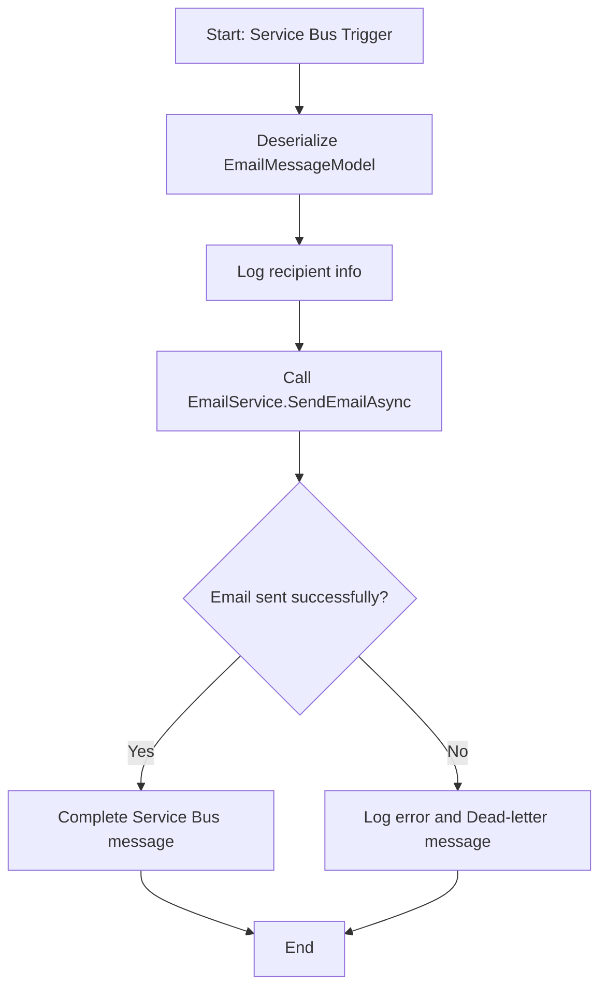

# EmailServiceFunction

// Har använt Ai - assistans för texter, dummydata och få upp diagramen i github

An Azure Function (.NET 9) that listens to an Azure Service Bus queue and sends emails using Azure Communication Services.

## Features

- Listens to the `email-queue` on Azure Service Bus.
- Sends emails via Azure Communication Services.

## Configuration

### local.settings.json (for local development)
```
{ 
"IsEncrypted": false, 
"Values": { 
"AzureWebJobsStorage": "UseDevelopmentStorage=true", 
"FUNCTIONS_WORKER_RUNTIME": "dotnet-isolated", 
"AzureServiceBusConnectionString": "<your-service-bus-connection-string>", 
"AzureCommunicationServices:ConnectionString": "<your-acs-connection-string>", 
"AzureCommunicationServices:SenderAddress": "<your-sender-email>", 
"AzureCommunicationServices:SenderName": "<your-sender-name>" 
  } 
}
```

## Technologies & Packages

- **.NET 9**
- **Azure Functions**
- **Azure Communication Services**
- **Testing**
  - xUnit
  - Moq

## Getting Started

### Prerequisites

- .NET 9 SDK
- Azure Subscription
- Azure Communication Services resource
- Azure Service Bus namespace and queue

### Setup

1. Clone the repository:
   ```sh
   git clone <your-repo-url>
   cd EmailServiceFunction
   ```
---


### Project Structure
- EmailServiceFunction/Functions/EmailFunction.cs – Azure Function triggered by Service Bus queue messages.
-	EmailServiceFunction/Services/EmailService.cs – Email sending service using Azure Communication Services.
-	EmailServiceFunction/Models/EmailMessageModel.cs – Model for email message data.
-	EmailServiceFunction/Models/AzureCommunicationsSettings.cs – Model for Azure Communication Services configuration.
-	EmailServiceFunction/Dtos/EmailServiceResult.cs – DTO for email sending result.
-	EmailServiceFunction/Program.cs – Function host and dependency injection setup.
-	EmailServiceTest/ – Unit tests for the email service and function logic.

### Testing
  - Unit tests are located in the EmailServiceTest project.

### Notes
  -	The service requires valid Azure Communication Services and Azure Service Bus credentials, configured via environment variables or local.settings.json.
  -	The Azure Function uses the isolated worker model (dotnet-isolated), which is required for .NET 9 support.
  -	The function expects email messages in JSON format matching the EmailMessageModel structure.

---

## Activity Diagram


---
## Sequence Diagram 
```mermaid
sequenceDiagram
    participant ServiceBus as Azure Service Bus
    participant Function as EmailFunction
    participant EmailService as EmailService
    participant ACS as Azure Communication Services

    ServiceBus->>Function: Trigger with EmailMessageModel
    Function->>Function: Deserialize message
    Function->>EmailService: SendEmailAsync(emailMessage)
    EmailService->>ACS: SendAsync(EmailMessage)
    ACS-->>EmailService: SendEmailResult/Exception
    EmailService-->>Function: EmailServiceResult
    alt Success
        Function->>ServiceBus: CompleteMessageAsync
    else Failure
        Function->>Function: Log error
        Function->>ServiceBus: DeadLetterMessageAsync
    end
 ```   

