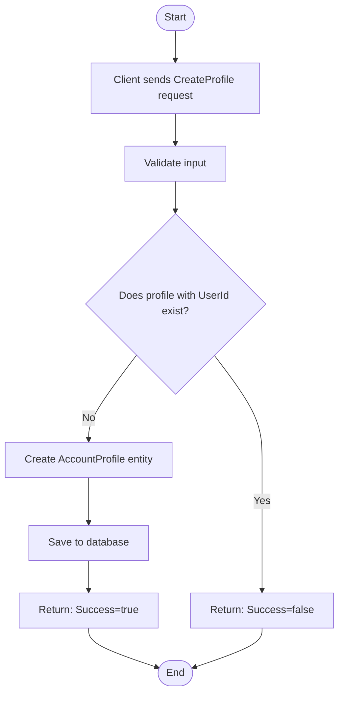
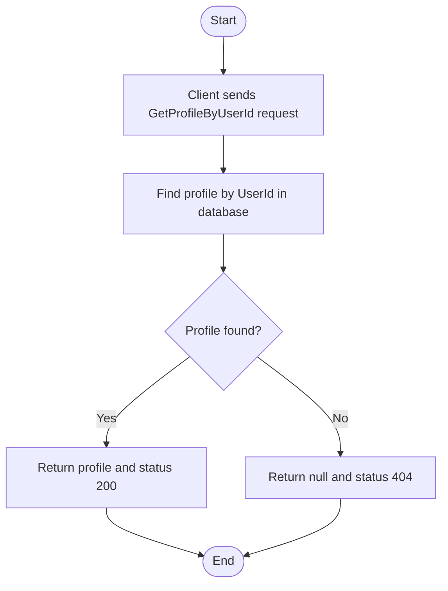
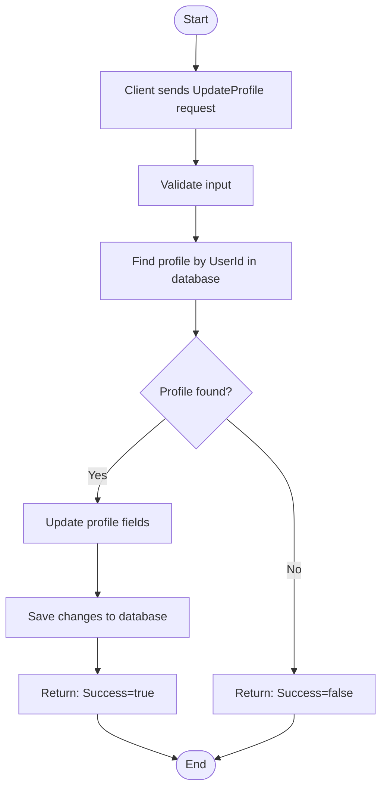
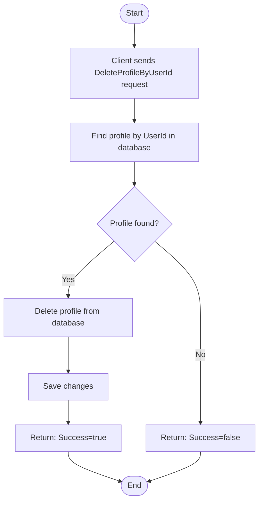
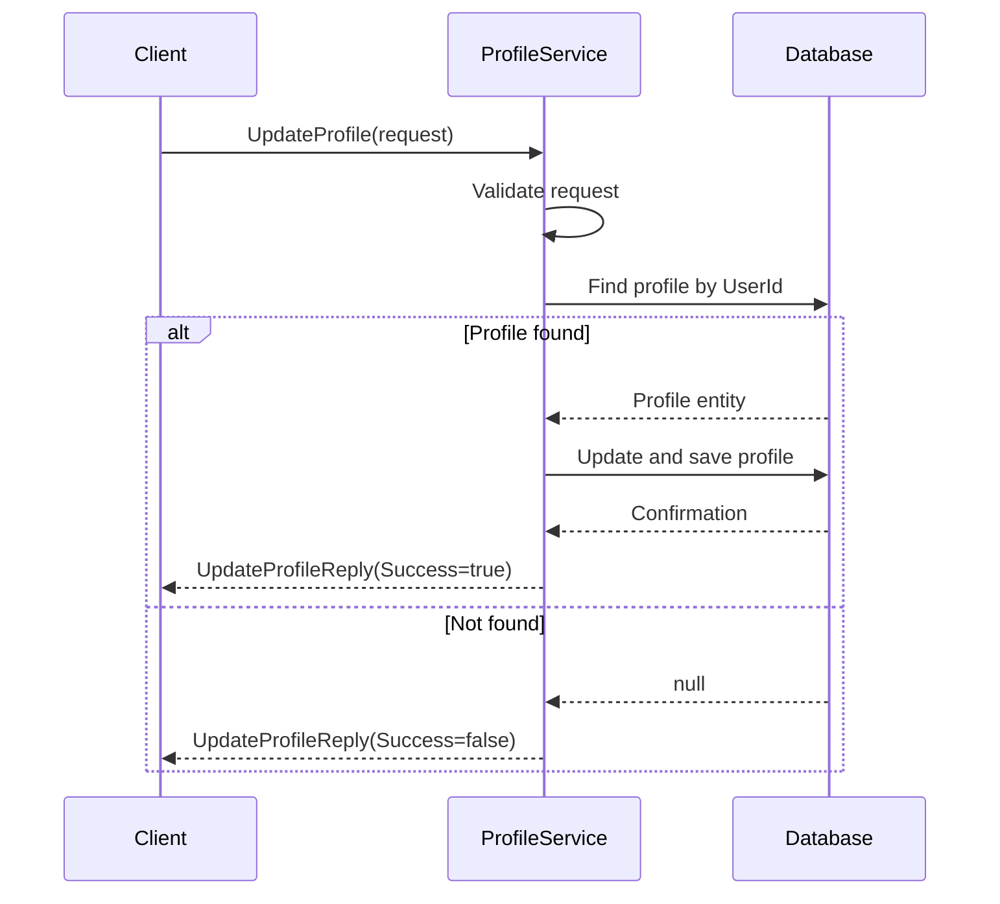
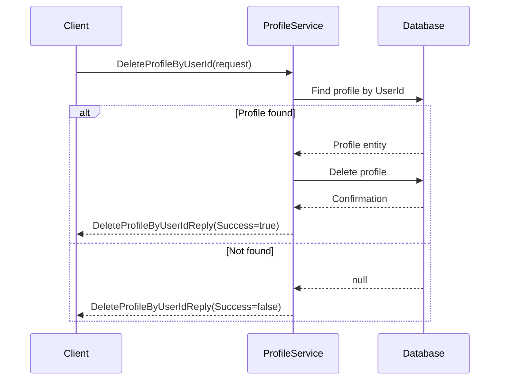

# EmailServiceFunction

// Har använt Ai - assistans för texter, dummydata och få upp diagramen i github

An Azure Function (.NET 9) that listens to an Azure Service Bus queue and sends emails using Azure Communication Services.

## Features

- Listens to the `email-queue` on Azure Service Bus.
- Sends emails via Azure Communication Services.

## Configuration

### local.settings.json (for local development)
{ 
"IsEncrypted": false, 
"Values": { 
"AzureWebJobsStorage": "UseDevelopmentStorage=true", 
"FUNCTIONS_WORKER_RUNTIME": "dotnet-isolated", 
"AzureServiceBusConnectionString": "<your-service-bus-connection-string>", 
"AzureCommunicationServices:ConnectionString": "<your-acs-connection-string>", 
"AzureCommunicationServices:SenderAddress": "<your-sender-email>", 
"AzureCommunicationServices:SenderName": "<your-sender-name>" 
  } 
}

## Technologies & Packages

- **.NET 9**
- **Azure Functions**
- **Azure Communication Services**
- **Testing**
  - xUnit
  - Moq

## Getting Started

### Prerequisites

- .NET 9 SDK
- Azure Subscription
- Azure Communication Services resource
- Azure Service Bus namespace and queue

### Setup

1. Clone the repository:
   ```sh
   git clone <your-repo-url>
   cd GrpcAccountProfileService
   ```
---


  ### Project Structure
  - GrpcAccountProfileService/Services/ProfileService.cs – gRPC service implementation
  - GrpcAccountProfileService/Contexts/AccountProfileContext.cs – EF Core DbContext
  - GrpcAccountProfileService/Entities/ – Entity models
  - GrpcAccountProfileService/Protos/profile.proto – gRPC service and message definitions
  - AccountProfileService.Tests/ – Integration and unit tests

### Testing
  - Integration tests are located in the AccountProfileService.Tests project.

### Notes
  - The service requires HTTP/2 for gRPC endpoints.
  - For browser-based clients, consider adding gRPC-Web support.
  - For Azure App Service deployment, use a Linux plan for native gRPC support.


## Activity Diagram
## Create Profile

---
## Get Profile By UserId

## Update Profile

## Delete Profile By UserId

    
## Sequence Diagram 
## Create Profile
```mermaid
sequenceDiagram
    participant Client
    participant Service as ProfileService
    participant DB as Database

    Client->>Service: CreateProfile(request)
    Service->>Service: Validate request
    Service->>DB: Check if UserId exists
    alt UserId exists
        Service-->>Client: CreateProfileReply(Success=false, Message="A profile with the given UserId already exists.")
    else UserId does not exist
        Service->>DB: Save AccountProfile
        DB-->>Service: Confirmation
        Service-->>Client: CreateProfileReply(Success=true, Message="Account succesfully created")
    end
 ```   
Get Profile By UserId
```mermaid
sequenceDiagram
    participant Client
    participant Service as ProfileService
    participant DB as Database

    Client->>Service: GetProfileByUserId(request)
    Service->>DB: Find profile by UserId
    alt Profile found
        DB-->>Service: Profile entity
        Service-->>Client: GetProfileByUserIdReply(Profile, StatusCode=200)
    else Not found
        DB-->>Service: null
        Service-->>Client: GetProfileByUserIdReply(Profile=null, StatusCode=404)
    end
```
Update Profile

Delete Profile By UserId

